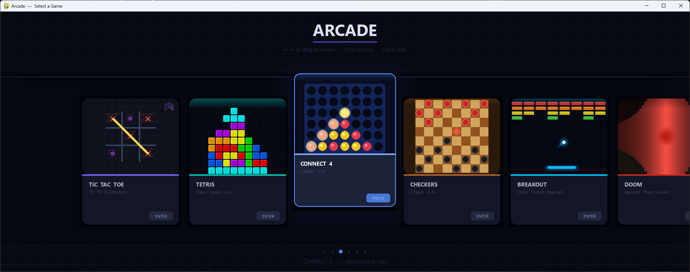

# Retro Arcade



A collection of classic arcade games built with Python and Pygame. All games launch from a single unified arcade frontend.

## Games

| Game | Modes |
|------|-------|
| **Breakout** | Classic, Endless, Watch AI, Rival Challenge, Paddle Battle |
| **Tetris** | Single-player with AI opponent option |
| **Checkers** | Player vs Player / Player vs AI |
| **Connect 4** | Player vs Player / Player vs AI |
| **Tic Tac Toe** | Player vs Player / Player vs AI |
| **Doom** | Raycasting FPS |

## Requirements

- Python 3.8+
- Pygame

```
pip install pygame
```

## Running

```
python arcade.py
```

## Breakout Modes

- **Classic** — Standard Breakout. Clear all bricks across increasingly difficult levels.
- **Endless** — Bricks keep coming. Survive as long as you can.
- **Watch AI** — Sit back and watch the AI play. Automatically advances through levels.
- **Rival Challenge** — Split-screen head-to-head. You vs AI, side by side. First to fall behind loses.
- **Paddle Battle** — You control the bottom paddle, AI controls the top. Bricks in the middle — whoever clears them wins.

### Breakout Controls

| Input | Action |
|-------|--------|
| Mouse / Arrow Keys / A & D | Move paddle |
| Left Click / Z / Shift / Ctrl | Fire laser (when powered up) |
| R | Restart |
| ESC | Back to menu |
| F11 | Toggle fullscreen |

### Powerups

| Icon | Name | Effect |
|------|------|--------|
| **M** | Multi | Splits ball into 3 |
| **W** | Wide | Widens your paddle |
| **S** | Slow | Slows the ball |
| **L** | Laser | Shoot lasers from your paddle |
| **P** | Pierce | Ball passes through bricks |
